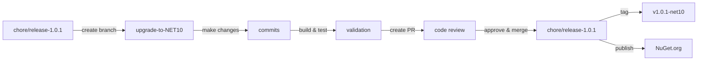

# .NET 10.0 Upgrade Plan - Obfuscator Solution

## Table of Contents

1. [Executive Summary](#executive-summary)
2. [Migration Strategy](#migration-strategy)
3. [Detailed Dependency Analysis](#detailed-dependency-analysis)
4. [Project-by-Project Plans](#project-by-project-plans)
   - [src\Obfuscator.csproj](#srcobfuscatorcsproj)
   - [tests\Obfuscator.tests\Obfuscator.tests.csproj](#testsobfuscatortestsobfuscatortestscsproj)
5. [Package Update Reference](#package-update-reference)
6. [Breaking Changes Catalog](#breaking-changes-catalog)
7. [Risk Management](#risk-management)
8. [Testing & Validation Strategy](#testing--validation-strategy)
9. [Complexity & Effort Assessment](#complexity--effort-assessment)
10. [Source Control Strategy](#source-control-strategy)
11. [Success Criteria](#success-criteria)

---

## Executive Summary

### Scenario Description

Upgrade the Obfuscator solution from .NET 8.0 to .NET 10.0 (Long Term Support). This is a clean library project focused on data obfuscation functionality with a companion test suite.

### Scope

**Projects Affected:** 2 projects
- `src\Obfuscator.csproj` - Main data obfuscation library (134 LOC)
- `tests\Obfuscator.tests\Obfuscator.tests.csproj` - Test project (368 LOC)

**Current State:**
- Both projects target net8.0
- Total codebase: 502 lines of code
- 10 NuGet package dependencies
- Simple dependency structure: tests → library

**Target State:**
- Both projects targeting net10.0
- All package references updated to .NET 10-compatible versions
- Zero build errors, zero warnings
- All tests passing

### Selected Strategy

**All-At-Once Strategy** - All projects upgraded simultaneously in single operation.

**Rationale:**
- **Small solution**: Only 2 projects (well below threshold)
- **Simple structure**: Linear dependency (tests depend on library, no cycles)
- **Homogeneous state**: All projects currently on .NET 8.0
- **Low complexity**: 502 total LOC, no API compatibility issues
- **Clear compatibility**: All 489 analyzed APIs are compatible
- **Package clarity**: Only 3 packages need updates (all have known target versions)

### Complexity Assessment

**Discovered Metrics:**
| Metric | Value | Assessment |
|--------|-------|------------|
| Total Projects | 2 | Very Small |
| Dependency Depth | 1 | Simple Linear |
| Total LOC | 502 | Very Small |
| Package Updates | 3 | Minimal |
| Security Vulnerabilities | 0 | Clean |
| API Compatibility Issues | 0 | Full Compatibility |
| Breaking Changes | 0 | None Detected |

**Classification: SIMPLE**

This solution has no complexity indicators that would require phased or incremental approach. Single atomic upgrade is optimal.

### Critical Issues

**✅ No Blocking Issues:**
- No security vulnerabilities detected
- No deprecated APIs in use
- All packages have .NET 10-compatible versions
- No breaking changes identified in API analysis

**⚠️ Minor Attention Required:**
- `xunit` package (v2.9.3) is marked as deprecated in tests project
- Should consider migration path during upgrade
- Does not block upgrade execution

### Recommended Approach

Execute atomic upgrade in single coordinated operation:
1. Update both project files to net10.0 simultaneously
2. Update all 3 package references across both projects
3. Restore and build solution
4. Execute test suite for validation
5. Single commit for entire upgrade

**Expected Duration Complexity:** Low - straightforward upgrade with minimal surface area

### Iteration Strategy

**Fast Batch Approach** - Given the simple classification:
- Phase 1-2: Foundation (3 iterations) - Complete ✓
- Phase 3: Detail Generation (2 iterations planned)
  - Iteration 3.1: Both projects detailed specifications (batched)
  - Iteration 3.2: Final sections (success criteria, source control)

---

## Migration Strategy

### Approach Selection: All-At-Once

**Selected Strategy:** All-At-Once Atomic Upgrade

**Justification:**

This solution meets all criteria for All-at-Once migration:

✅ **Small Solution:** 2 projects (< 5 project threshold)  
✅ **Simple Dependencies:** Linear structure, depth = 1, no cycles  
✅ **Homogeneous State:** All projects on .NET 8.0  
✅ **Low Risk:** No security vulnerabilities, no breaking changes  
✅ **Package Clarity:** All updates have known target versions  
✅ **Small Codebase:** 502 LOC total, minimal surface area

**Why Not Incremental:**
- Overhead of multi-targeting would exceed the risk for 2 small projects
- No intermediate testing value (tests depend on library - can't test in isolation)
- No coordination complexity (single developer library, not distributed team)
- Solution is already well-tested (368 LOC of tests vs 134 LOC of library = 2.7:1 ratio)

### All-At-Once Strategy Rationale

**Core Principle:** Update all projects and packages simultaneously, then build and validate the entire solution as a unit.

**Benefits for This Solution:**
1. **Fastest Completion:** Single operation vs multiple phases
2. **No Multi-Targeting:** Avoid complexity of supporting multiple frameworks
3. **Atomic State:** Solution is either on .NET 8 or .NET 10, no mixed state
4. **Simple Testing:** Test entire solution once vs incremental validation
5. **Clean History:** Single commit captures entire upgrade

**Risk Mitigation:**
- Small codebase minimizes chance of unexpected issues
- Comprehensive test suite (368 LOC) provides safety net
- All APIs pre-validated as compatible (0 breaking changes detected)
- Git branch isolation allows safe experimentation

### Dependency-Based Ordering

**Build Order (MSBuild will enforce automatically):**

1. **Obfuscator.csproj** (Library)
   - No project dependencies, builds first
   - Must succeed before tests can build

2. **Obfuscator.tests.csproj** (Tests)
   - Depends on Obfuscator.csproj
   - Builds after library compiles

**Update Order (All-at-Once execution):**

Despite the build order, the All-at-Once strategy updates all project files simultaneously:
1. Update `TargetFramework` to `net10.0` in both .csproj files
2. Update package versions in both .csproj files  
3. Execute `dotnet restore` (restores for entire solution)
4. Execute `dotnet build` (MSBuild respects dependency order automatically)
5. Fix any compilation errors discovered
6. Execute `dotnet test` to validate functionality

**Rationale:** Since both projects are SDK-style and have clear package compatibility, there's no risk in updating project files simultaneously. The build system handles dependency order naturally.

### Parallel vs Sequential Execution

**Approach: Pseudo-Parallel (Sequential Execution, Atomic Scope)**

**File Updates:** Sequential (must edit files one at a time), but scope is atomic
- Update Obfuscator.csproj
- Update Obfuscator.tests.csproj
- Both changes treated as single logical unit

**Build Execution:** Parallel (MSBuild default)
- MSBuild will build both projects in dependency order
- Build engine can parallelize where dependencies allow
- Use `dotnet build` without explicit project path to build entire solution

**Testing Execution:** Sequential (xunit default)
- Test project runs after successful solution build
- Single test assembly (Obfuscator.tests.dll)

**Rationale:** For 2 projects with 502 LOC total, parallel execution overhead exceeds benefits. Sequential file editing with atomic commit provides optimal simplicity-to-speed ratio.

### Phase Definitions

**Phase 0: Prerequisites (If Needed)**
- Verify .NET 10 SDK installed
- Check for global.json conflicts (none expected)
- Confirm branch isolation (upgrade-to-NET10)

**Phase 1: Atomic Upgrade**

**Scope:** All projects, all packages, all compilation fixes

**Operations:**
1. Update `TargetFramework` property in all .csproj files
2. Update `PackageReference` versions for all flagged packages
3. Restore dependencies (`dotnet restore`)
4. Build solution (`dotnet build`)
5. Fix compilation errors if any (none expected based on compatibility analysis)
6. Rebuild to verify success

**Deliverables:**
- Both projects target net10.0
- All package references updated
- Solution builds with 0 errors
- Solution builds with 0 warnings (TreatWarningsAsErrors=true in Release mode)

**Phase 2: Validation**

**Scope:** Functional and quality validation

**Operations:**
1. Execute test suite (`dotnet test`)
2. Verify all tests pass
3. Review test output for warnings or behavioral changes
4. Validate package restore works correctly
5. Spot-check Release build

**Deliverables:**
- All tests pass (0 failures)
- No test warnings
- Release configuration builds successfully

**Phase 3: Finalization**

**Scope:** Documentation and source control

**Operations:**
1. Update README.md if it mentions .NET version
2. Update package release notes if applicable
3. Commit all changes with descriptive message
4. Tag commit if following versioning strategy

**Deliverables:**
- Clean commit history
- Updated documentation
- Ready for merge to main branch

### Risk-Specific Considerations

**Deprecated xunit Package:**
- Current: xunit 2.9.3 (marked deprecated)
- **Decision:** Keep current version for this upgrade
- **Rationale:** 
  - xunit 2.9.3 is compatible with .NET 10
  - Changing test framework is orthogonal to framework upgrade
  - Reduces upgrade scope and risk
  - Can address in separate PR after framework upgrade validated
- **Future Action:** Consider migrating to xunit 3.x in future (separate effort)

**LangVersion Setting:**
- Current: `<LangVersion>8.0</LangVersion>` in Obfuscator.csproj
- **Decision:** Evaluate during compilation
- **Options:**
  1. Keep at 8.0 (conservative, limits new language features)
  2. Update to 10.0 (enables C# 10 features)
  3. Remove (defaults to latest supported by SDK)
- **Recommendation:** Remove or update to 12.0 (C# 12 is .NET 10 default) to access modern language features

**Microsoft.SourceLink.GitHub:**
- Current: 8.0.0
- **Assessment:** Compatible with .NET 10 (build-time only dependency)
- **Decision:** Keep current version (1.x is latest as of knowledge cutoff)
- **Rationale:** SourceLink versions align with tooling, not runtime framework

### Success Criteria for Strategy

The All-at-Once strategy succeeds when:

✅ All projects updated to net10.0 in single commit  
✅ All flagged packages updated simultaneously  
✅ Solution builds with 0 errors on first attempt after fixes  
✅ All tests pass without modification  
✅ No new warnings introduced  
✅ Total execution time < 30 minutes (expected < 15 minutes for this size)

---

## Detailed Dependency Analysis

### Dependency Graph Summary

The Obfuscator solution has a simple, linear dependency structure with no cycles or complex relationships.

```
┌─────────────────────────────────┐
│  Obfuscator.tests.csproj        │
│  (Test Project)                 │
│  net8.0 → net10.0              │
└────────────┬────────────────────┘
             │ depends on
             ▼
┌─────────────────────────────────┐
│  Obfuscator.csproj              │
│  (Library - Leaf Node)          │
│  net8.0 → net10.0              │
└─────────────────────────────────┘
```

### Project Groupings by Migration Phase

**Single Migration Phase: Atomic Upgrade**

Since this is an All-at-Once strategy with only 2 projects and no complexity indicators, all projects are upgraded simultaneously in a single phase.

**Phase 1 - Atomic Upgrade (All Projects):**
1. `src\Obfuscator.csproj` (Library - 0 dependencies)
2. `tests\Obfuscator.tests\Obfuscator.tests.csproj` (Tests - depends on #1)

Both projects update together atomically. Although the test project depends on the library, the All-at-Once approach updates project files and packages simultaneously, then builds the entire solution in one pass.

### Critical Path Identification

**Critical Path: Library → Tests**

1. **Obfuscator.csproj** (Library)
   - Leaf node with zero project dependencies
   - 4 NuGet packages (2 require updates)
   - Must build successfully before tests can build
   - **Criticality:** Foundation for entire solution

2. **Obfuscator.tests.csproj** (Tests)
   - Depends on Obfuscator.csproj
   - 6 NuGet packages (1 deprecated package to address)
   - Validates library functionality
   - **Criticality:** Quality gate for upgrade

**Build Order:** In practice, MSBuild will build Obfuscator.csproj first (dependency), then Obfuscator.tests.csproj automatically. The All-at-Once approach means we update all project files first, then let the build system respect dependencies.

### Circular Dependency Analysis

**✅ No Circular Dependencies Detected**

The dependency graph is a clean Directed Acyclic Graph (DAG) with no cycles. This eliminates a major source of complexity in the upgrade.

### External Dependencies

**NuGet Package Dependencies:**

**Obfuscator.csproj:**
- Microsoft.Extensions.Compliance.Abstractions 8.10.0 → Compatible
- Microsoft.Extensions.Compliance.Redaction 8.10.0 → Compatible  
- Microsoft.Extensions.DependencyInjection.Abstractions 8.0.2 → **10.0.3**
- System.Text.Json 8.0.6 → **10.0.3**
- Microsoft.SourceLink.GitHub 8.0.0 → Compatible

**Obfuscator.tests.csproj:**
- Microsoft.NET.Test.Sdk 18.0.1 → Compatible
- xunit 2.9.3 → **⚠️ Deprecated** (functionally compatible)
- xunit.runner.visualstudio 3.1.5 → Compatible
- Moq 4.20.72 → Compatible
- coverlet.collector 6.0.4 → Compatible

**Key Observations:**
- Only 2 packages require version updates (both in library project)
- 1 deprecated package (xunit) but still functional with net10.0
- No package conflicts or incompatible packages detected
- All Microsoft.Extensions.Compliance.* packages already at latest versions (8.10.0 supports .NET 6+)

### Migration Order Rationale

**Why All-at-Once:**
1. **Small Surface Area:** Only 2 projects, 502 LOC total
2. **Low Risk:** No API breaking changes, no security vulnerabilities
3. **Clear Dependencies:** Simple linear dependency structure
4. **Package Stability:** Only 2 package updates required, all compatible
5. **Testing Coverage:** Test project provides immediate validation
6. **No Intermediate State Needed:** No multi-targeting requirements

The overhead of incremental migration (multi-targeting, partial testing, coordination) exceeds the risk of atomic upgrade for a solution of this size and simplicity.

---

## Project-by-Project Plans

### src\Obfuscator.csproj

#### Project Overview

**Type:** Class Library (SDK-style)  
**Purpose:** Data obfuscation library using Microsoft Extensions Compliance framework  
**Published:** Yes (NuGet package: EncineCarlos.Obfuscator)  
**Dependencies:** 0 project dependencies, 5 NuGet packages  
**Dependants:** 1 project (Obfuscator.tests.csproj)

#### Current State

**Target Framework:** `net8.0`

**Project Metrics:**
- Lines of Code: 134
- File Count: 5
- Package Count: 5 (4 runtime + 1 build-time)

**Current Dependencies:**
```xml
<PackageReference Include="Microsoft.Extensions.Compliance.Abstractions" Version="8.10.0" />
<PackageReference Include="Microsoft.Extensions.Compliance.Redaction" Version="8.10.0" />
<PackageReference Include="Microsoft.Extensions.DependencyInjection.Abstractions" Version="8.0.2" />
<PackageReference Include="System.Text.Json" Version="8.0.6" />
<PackageReference Include="Microsoft.SourceLink.GitHub" Version="8.0.0" PrivateAssets="All" />
```

**Project Configuration:**
- `LangVersion`: `8.0` (hardcoded, may limit C# features)
- `Nullable`: Enabled
- Documentation generation: Enabled
- Source Link: Enabled
- Symbol package: Enabled (snupkg)

**Risk Level:** 🟡 Medium (foundation library with external dependents)

#### Target State

**Target Framework:** `net10.0`

**Updated Dependencies:**
```xml
<PackageReference Include="Microsoft.Extensions.Compliance.Abstractions" Version="8.10.0" />
<PackageReference Include="Microsoft.Extensions.Compliance.Redaction" Version="8.10.0" />
<PackageReference Include="Microsoft.Extensions.DependencyInjection.Abstractions" Version="10.0.3" />
<PackageReference Include="System.Text.Json" Version="10.0.3" />
<PackageReference Include="Microsoft.SourceLink.GitHub" Version="8.0.0" PrivateAssets="All" />
```

**Configuration Considerations:**
- **LangVersion:** Recommend updating to `12.0` or removing (defaults to C# 12 for .NET 10)
- All other settings: Keep unchanged

**Expected Changes:** 2 package version updates, 1 framework target update, optional LangVersion update

#### Migration Steps

**Step 1: Prerequisites**

Verify environment:
- [ ] .NET 10 SDK installed (verify: `dotnet --list-sdks`)
- [ ] Currently on `upgrade-to-NET10` branch (already done)
- [ ] No pending changes in working directory

**Step 2: Update Project File**

Edit `src\Obfuscator.csproj`:

**Change 1: Update TargetFramework**
```xml
<!-- Before -->
<TargetFramework>net8.0</TargetFramework>

<!-- After -->
<TargetFramework>net10.0</TargetFramework>
```

**Change 2: Update Package References**
```xml
<!-- Update from 8.0.2 to 10.0.3 -->
<PackageReference Include="Microsoft.Extensions.DependencyInjection.Abstractions" Version="10.0.3" />

<!-- Update from 8.0.6 to 10.0.3 -->
<PackageReference Include="System.Text.Json" Version="10.0.3" />
```

**Change 3 (Optional): Update LangVersion**
```xml
<!-- Option A: Update to C# 12 (explicit) -->
<LangVersion>12.0</LangVersion>

<!-- Option B: Remove (implicit - defaults to C# 12 for .NET 10) -->
<!-- <LangVersion>8.0</LangVersion> -->
```

**Recommendation:** Remove LangVersion to use latest supported (C# 12).

**Step 3: Restore Dependencies**

```bash
dotnet restore src\Obfuscator.csproj
```

**Expected Output:** All packages restore successfully, no conflicts

**Step 4: Build Project**

```bash
dotnet build src\Obfuscator.csproj --configuration Debug
```

**Expected Output:** Build succeeds with 0 errors, 0 warnings

**Step 5: Address Compilation Errors (If Any)**

**Expected:** 0 compilation errors (API compatibility analysis shows all 116 APIs compatible)

**If errors occur:**
1. Review error messages carefully
2. Check for namespace changes (unlikely)
3. Check for API signature changes (unlikely)
4. Consult .NET 10 breaking changes documentation
5. Fix errors incrementally

**Common Issues (unlikely but possible):**
- **System.Text.Json behavioral changes:** Review serialization/deserialization if custom converters used
- **Dependency injection abstractions:** Unlikely (abstractions are stable)

**Step 6: Rebuild for Verification**

```bash
dotnet build src\Obfuscator.csproj --configuration Release
```

**Expected Output:** 
- Release build succeeds
- No warnings (TreatWarningsAsErrors=true in Release mode)
- Documentation file generated
- Symbol package ready

#### Expected Breaking Changes

**From Assessment:** 0 binary incompatible, 0 source incompatible, 0 behavioral changes detected

**Potential Runtime Behavioral Changes:**

1. **System.Text.Json 8.0.6 → 10.0.3:**
   - Possible serialization behavior refinements
   - Improved performance (generally transparent)
   - New features available but not breaking existing code
   - **Mitigation:** Test suite will validate JSON operations

2. **Microsoft.Extensions.DependencyInjection.Abstractions 8.0.2 → 10.0.3:**
   - Abstractions-only package (interfaces, no implementation)
   - Very low likelihood of breaking changes
   - **Mitigation:** Compilation will fail if interfaces changed (unlikely)

**No code changes expected** based on compatibility analysis.

#### Code Modifications Expected

**Expected:** None (0 API incompatibilities detected)

**Possible (Low Probability):**

1. **Nullable Reference Type Warnings:**
   - .NET 10 may have stricter nullability checks
   - Project already has `<Nullable>enable</Nullable>`
   - **If warnings occur:** Address nullability annotations

2. **Obsolete API Warnings:**
   - Check build output for obsolete warnings
   - **If present:** Update to recommended replacement APIs

3. **LangVersion Update Side Effects:**
   - If LangVersion removed/updated, new C# 12 features available
   - May enable new analyzer warnings
   - **If problematic:** Revert LangVersion to `8.0`

#### Testing Strategy

**Unit Tests:** Executed via Obfuscator.tests.csproj (separate project)

**Pre-Upgrade Validation:**
- [ ] Verify current tests pass on .NET 8 (baseline)
- [ ] Document test count and pass rate

**Post-Upgrade Validation:**
- [ ] Run full test suite: `dotnet test`
- [ ] Compare test results to baseline
- [ ] All tests must pass
- [ ] No new test warnings

**Smoke Tests (Manual):**
- [ ] Verify package can be packed: `dotnet pack src\Obfuscator.csproj`
- [ ] Inspect .nupkg metadata (version, dependencies)
- [ ] Confirm .NET 10 is listed as target framework in package

**Specific Scenarios to Validate:**
- Obfuscation attribute detection ([SensitiveData])
- JSON serialization with JsonPropertyName
- Nested object handling
- Dependency injection registration (AddObfuscator)
- Redaction functionality

#### Validation Checklist

**Build Validation:**
- [ ] Project builds successfully (Debug configuration)
- [ ] Project builds successfully (Release configuration)
- [ ] 0 compilation errors
- [ ] 0 warnings in Release mode (TreatWarningsAsErrors enforced)
- [ ] Documentation file generated (Obfuscator.xml)

**Dependency Validation:**
- [ ] `dotnet restore` completes successfully
- [ ] No package conflicts reported
- [ ] Microsoft.Extensions.DependencyInjection.Abstractions 10.0.3 restored
- [ ] System.Text.Json 10.0.3 restored

**Functional Validation:**
- [ ] Test suite passes (see Obfuscator.tests.csproj section)
- [ ] No runtime exceptions during tests
- [ ] Obfuscation behavior unchanged
- [ ] JSON serialization behavior unchanged

**Package Validation:**
- [ ] `dotnet pack` succeeds
- [ ] .nupkg file created
- [ ] Package metadata correct (version, authors, dependencies)
- [ ] Target framework: net10.0
- [ ] Symbol package (.snupkg) generated

**Configuration Validation:**
- [ ] Source Link configuration intact
- [ ] README.md and LICENSE included in package
- [ ] Package release notes updated (if needed)

---

### tests\Obfuscator.tests\Obfuscator.tests.csproj

#### Project Overview

**Type:** Test Project (xUnit, SDK-style)  
**Purpose:** Unit and integration tests for Obfuscator library  
**Published:** No (test-only)  
**Dependencies:** 1 project (Obfuscator.csproj), 6 NuGet packages  
**Dependants:** 0 (leaf node - no projects depend on tests)

#### Current State

**Target Framework:** `net8.0`

**Project Metrics:**
- Lines of Code: 368 (2.7x the library code - excellent coverage)
- File Count: 3
- Package Count: 6 (test frameworks + tools)

**Current Dependencies:**
```xml
<PackageReference Include="coverlet.collector" Version="6.0.4" />
<PackageReference Include="Microsoft.NET.Test.Sdk" Version="18.0.1" />
<PackageReference Include="Moq" Version="4.20.72" />
<PackageReference Include="xunit" Version="2.9.3" />
<PackageReference Include="xunit.runner.visualstudio" Version="3.1.5" />
<ProjectReference Include="..\..\src\Obfuscator.csproj" />
```

**Notable Characteristics:**
- Uses xUnit test framework (v2.9.3 - marked deprecated)
- Uses Moq for mocking
- Code coverage via coverlet
- Visual Studio test runner integration

**Risk Level:** 🟢 Low (test-only project, no dependents, can be fixed independently)

#### Target State

**Target Framework:** `net10.0`

**Updated Dependencies:**
```xml
<!-- All packages remain at current versions - all compatible with net10.0 -->
<PackageReference Include="coverlet.collector" Version="6.0.4" />
<PackageReference Include="Microsoft.NET.Test.Sdk" Version="18.0.1" />
<PackageReference Include="Moq" Version="4.20.72" />
<PackageReference Include="xunit" Version="2.9.3" /> <!-- Deprecated but compatible -->
<PackageReference Include="xunit.runner.visualstudio" Version="3.1.5" />
<ProjectReference Include="..\..\src\Obfuscator.csproj" />
```

**Key Decision:** Keep xunit 2.9.3 despite deprecation
- **Rationale:** Functionally compatible with .NET 10, reduces upgrade scope
- **Future Action:** Migrate to xunit 3.x in separate PR after framework upgrade validated

**Expected Changes:** 1 framework target update, 0 package updates

#### Migration Steps

**Step 1: Prerequisites**

Verify library project updated:
- [ ] Obfuscator.csproj builds successfully on net10.0
- [ ] Obfuscator.csproj tests passed on .NET 8 (baseline metrics)

**Step 2: Update Project File**

Edit `tests\Obfuscator.tests\Obfuscator.tests.csproj`:

**Change 1: Update TargetFramework**
```xml
<!-- Before -->
<TargetFramework>net8.0</TargetFramework>

<!-- After -->
<TargetFramework>net10.0</TargetFramework>
```

**No package updates required** - all test packages are compatible.

**Step 3: Restore Dependencies**

```bash
dotnet restore tests\Obfuscator.tests\Obfuscator.tests.csproj
```

**Expected Output:** 
- All packages restore successfully
- xunit 2.9.3 restores without errors (despite deprecation warning)
- Obfuscator.csproj referenced successfully

**Step 4: Build Test Project**

```bash
dotnet build tests\Obfuscator.tests\Obfuscator.tests.csproj --configuration Debug
```

**Expected Output:** Build succeeds with 0 errors

**Possible Warnings:**
- Deprecation warning for xunit 2.9.3 (expected, can be ignored)
- No other warnings expected

**Step 5: Address Compilation Errors (If Any)**

**Expected:** 0 compilation errors (API compatibility shows all 373 APIs compatible)

**If errors occur:**
1. Check if related to xunit framework API changes (unlikely for 2.9.3)
2. Check if related to Obfuscator library API changes (unlikely)
3. Check for test utility API changes
4. Fix incrementally

**Unlikely Issues:**
- xunit 2.9.3 is mature and stable on .NET 10
- Moq 4.20.72 is compatible
- Test code uses standard patterns

**Step 6: Run Test Suite**

```bash
dotnet test tests\Obfuscator.tests\Obfuscator.tests.csproj --configuration Debug
```

**Expected Output:**
- All tests execute
- All tests pass (0 failures)
- Test count matches baseline
- Coverage collected successfully

**Step 7: Verify Release Configuration**

```bash
dotnet build tests\Obfuscator.tests\Obfuscator.tests.csproj --configuration Release
dotnet test tests\Obfuscator.tests\Obfuscator.tests.csproj --configuration Release
```

**Expected Output:** Release build and tests succeed

#### Expected Breaking Changes

**From Assessment:** 0 binary incompatible, 0 source incompatible, 0 behavioral changes detected

**Deprecated Package Consideration:**

**xunit 2.9.3 Deprecation:**
- **Status:** Deprecated but functionally compatible with .NET 10
- **Migration Path:** xunit 2.x → xunit 3.x (future effort)
- **Impact:** None for this upgrade (framework upgrade orthogonal to test framework upgrade)

**Potential Issues (Low Probability):**

1. **xunit Runner Compatibility:**
   - Visual Studio test runner should work (3.1.5 is recent)
   - If discovery fails: update xunit.runner.visualstudio to latest
   - **Likelihood:** Very low

2. **Test Discovery Changes:**
   - .NET 10 test host may have minor changes
   - Should be transparent with Microsoft.NET.Test.Sdk 18.0.1
   - **Mitigation:** Test execution will reveal any issues immediately

3. **Moq Behavior:**
   - Moq 4.20.72 is compatible
   - Mock setups should work unchanged
   - **Mitigation:** Test failures will be obvious if mocking breaks

#### Code Modifications Expected

**Expected:** None (0 API incompatibilities in test dependencies)

**Possible (Very Low Probability):**

1. **Test Attribute Changes:**
   - xunit [Fact], [Theory] attributes should be unchanged
   - **If issues:** Check xunit 2.9.3 release notes

2. **Assertion API Changes:**
   - Assert.* methods should be stable
   - **If issues:** Update assertion syntax

3. **Moq Setup Changes:**
   - Mock<T> setup syntax should be unchanged
   - **If issues:** Review Moq 4.20.72 compatibility

**Recommendation:** Make no preemptive code changes; address issues only if they surface during test execution.

#### Testing Strategy

**Pre-Upgrade Baseline:**
- [ ] Run tests on .NET 8: `dotnet test` (before any changes)
- [ ] Document test count, pass count, duration
- [ ] Ensure 100% pass rate

**Post-Upgrade Validation:**
- [ ] Run tests on .NET 10: `dotnet test` (after framework update)
- [ ] Compare test count (should be identical)
- [ ] Compare pass count (should be 100%)
- [ ] Review duration (may be faster on .NET 10)
- [ ] Check coverage report

**Test Categories to Validate:**

Based on library functionality (inferred from project description):
- [ ] SensitiveData attribute detection tests
- [ ] JsonPropertyName attribute handling tests
- [ ] Nested object obfuscation tests
- [ ] Redaction functionality tests
- [ ] Dependency injection registration tests
- [ ] Edge cases (null handling, empty objects, etc.)

**Specific Test Scenarios:**
- All [Fact] tests execute
- All [Theory] tests with test data execute
- Moq mock setups work correctly
- Assertions pass as expected
- No flaky tests introduced

#### Validation Checklist

**Build Validation:**
- [ ] Test project builds successfully (Debug configuration)
- [ ] Test project builds successfully (Release configuration)
- [ ] 0 compilation errors
- [ ] Acceptable warnings (only xunit deprecation expected)

**Dependency Validation:**
- [ ] `dotnet restore` completes successfully
- [ ] No package conflicts
- [ ] xunit 2.9.3 restores (despite deprecation)
- [ ] Obfuscator.csproj project reference resolves
- [ ] All transitive dependencies resolve

**Test Execution Validation:**
- [ ] All tests discovered by test runner
- [ ] Test count matches baseline
- [ ] 100% pass rate (0 failures, 0 skipped)
- [ ] No test timeouts
- [ ] No test infrastructure errors

**Test Framework Validation:**
- [ ] xunit test discovery works
- [ ] xunit test execution works
- [ ] Visual Studio test runner integration works
- [ ] `dotnet test` CLI works
- [ ] Coverage collection works (coverlet)

**Functional Validation:**
- [ ] Library functionality validated via tests
- [ ] No behavioral regressions detected
- [ ] Performance acceptable (may improve)
- [ ] Coverage metrics maintained or improved

**Output Validation:**
- [ ] Test results output format correct
- [ ] Coverage report generated
- [ ] No unexpected error messages
- [ ] Duration metrics recorded

#### Future Considerations

**xunit 2.x → 3.x Migration (Future PR):**

When ready to address deprecation:
1. Update xunit 2.9.3 → 3.x (latest)
2. Update xunit.runner.visualstudio if needed
3. Review xunit 3.x breaking changes documentation
4. Update test code if APIs changed
5. Rerun test suite
6. Separate PR: "Migrate to xunit 3.x"

**Rationale for Deferring:**
- Keeps current upgrade focused on framework
- xunit 2.9.3 is stable and works
- Reduces variables and risk
- Easier to troubleshoot if issues arise (one change at a time)

---

## Package Update Reference

### Overview

**Total Packages:** 10  
**Packages Requiring Updates:** 2  
**Deprecated Packages:** 1 (keeping current version)  
**Packages Staying Current:** 7

### Packages Requiring Updates

| Package | Current | Target | Projects Affected | Update Reason | Breaking Changes |
|---------|---------|--------|-------------------|---------------|------------------|
| Microsoft.Extensions.DependencyInjection.Abstractions | 8.0.2 | 10.0.3 | Obfuscator.csproj | Framework compatibility, abstractions alignment | None expected (abstractions-only) |
| System.Text.Json | 8.0.6 | 10.0.3 | Obfuscator.csproj | Framework compatibility, performance improvements | None detected, possible minor behavioral refinements |

### Packages Staying at Current Versions

**Compatible Without Updates:**

| Package | Version | Projects | Rationale |
|---------|---------|----------|-----------|
| Microsoft.Extensions.Compliance.Abstractions | 8.10.0 | Obfuscator.csproj | Already at latest (8.10.0 supports .NET 6+), no .NET 10-specific version |
| Microsoft.Extensions.Compliance.Redaction | 8.10.0 | Obfuscator.csproj | Already at latest (8.10.0 supports .NET 6+), no .NET 10-specific version |
| Microsoft.SourceLink.GitHub | 8.0.0 | Obfuscator.csproj | Build-time only, version aligns with tooling not runtime, compatible |
| Microsoft.NET.Test.Sdk | 18.0.1 | Obfuscator.tests.csproj | Already at latest, cross-framework compatible |
| xunit.runner.visualstudio | 3.1.5 | Obfuscator.tests.csproj | Latest version, cross-framework compatible |
| Moq | 4.20.72 | Obfuscator.tests.csproj | Latest version, .NET 10 compatible |
| coverlet.collector | 6.0.4 | Obfuscator.tests.csproj | Latest version, .NET 10 compatible |

**Deprecated But Compatible:**

| Package | Version | Projects | Status | Decision |
|---------|---------|----------|--------|----------|
| xunit | 2.9.3 | Obfuscator.tests.csproj | ⚠️ Deprecated | Keep for this upgrade, migrate to xunit 3.x in future PR |

### Package Update Details

#### Microsoft.Extensions.DependencyInjection.Abstractions 8.0.2 → 10.0.3

**Project:** `src\Obfuscator.csproj`

**Current Usage:**
```xml
<PackageReference Include="Microsoft.Extensions.DependencyInjection.Abstractions" Version="8.0.2" />
```

**Target Usage:**
```xml
<PackageReference Include="Microsoft.Extensions.DependencyInjection.Abstractions" Version="10.0.3" />
```

**Change Category:** Minor version jump (2 major versions)

**Breaking Changes:** None expected
- This is an abstractions package (interfaces only)
- `IServiceCollection`, `IServiceProvider` interfaces are stable
- Extension method signatures unchanged
- Behavioral compatibility maintained

**Known Enhancements in 10.0.3:**
- Performance improvements in service resolution
- Better diagnostics for service configuration issues
- No API surface changes

**Migration Actions:** None (automatic update)

**Testing Focus:**
- Dependency injection registration (AddObfuscator pattern)
- Service resolution at runtime
- Scope management (if used)

**Risk Level:** 🟢 Very Low (abstractions are intentionally stable)

---

#### System.Text.Json 8.0.6 → 10.0.3

**Project:** `src\Obfuscator.csproj`

**Current Usage:**
```xml
<PackageReference Include="System.Text.Json" Version="8.0.6" />
```

**Target Usage:**
```xml
<PackageReference Include="System.Text.Json" Version="10.0.3" />
```

**Change Category:** Minor version jump (2 major versions)

**Breaking Changes:** None detected by API analysis
- All APIs marked compatible
- Serialization/deserialization signatures unchanged
- JsonSerializer.* methods stable

**Known Enhancements in 10.0.x:**
- Improved source generation performance
- Better null handling
- Enhanced reflection-based serialization
- Performance improvements (faster serialization/deserialization)
- Better trimming compatibility

**Potential Behavioral Changes (Non-Breaking):**
- Minor serialization format changes (edge cases)
- Improved handling of circular references
- Better exception messages
- Stricter validation (may catch previously-silent issues)

**Migration Actions:** None expected
- Review test results for serialization behavior
- Existing serialization should work unchanged
- JsonPropertyName attribute handling unchanged

**Testing Focus:**
- JsonPropertyName attribute support (mentioned in project description)
- Nested object serialization
- Custom converters (if any)
- Null handling
- Edge cases (empty objects, special characters)

**Risk Level:** 🟡 Low-Medium (behavioral changes possible but non-breaking)

**Mitigation:**
- Comprehensive test suite covers JSON serialization
- Any behavioral changes will surface in tests
- .NET 10 JSON improvements typically enhance correctness

---

### Package Dependency Tree

**Obfuscator.csproj Dependencies:**
```
Obfuscator.csproj (net10.0)
├── Microsoft.Extensions.Compliance.Abstractions 8.10.0
│   └── (no further dependencies)
├── Microsoft.Extensions.Compliance.Redaction 8.10.0
│   ├── Microsoft.Extensions.Compliance.Abstractions 8.10.0 ✓ (already referenced)
│   └── (framework dependencies)
├── Microsoft.Extensions.DependencyInjection.Abstractions 10.0.3 ⬆️
│   └── (framework dependencies)
├── System.Text.Json 10.0.3 ⬆️
│   └── (framework dependencies)
└── Microsoft.SourceLink.GitHub 8.0.0 (build-time only)
    └── (build tools)
```

**Obfuscator.tests.csproj Dependencies:**
```
Obfuscator.tests.csproj (net10.0)
├── ProjectReference: Obfuscator.csproj ⬆️
│   └── (inherits all Obfuscator packages)
├── Microsoft.NET.Test.Sdk 18.0.1
│   └── (test infrastructure)
├── xunit 2.9.3 ⚠️ (deprecated but compatible)
│   ├── xunit.core 2.9.3
│   └── xunit.assert 2.9.3
├── xunit.runner.visualstudio 3.1.5
│   └── (test runner)
├── Moq 4.20.72
│   └── (mocking framework)
└── coverlet.collector 6.0.4
    └── (coverage tool)
```

### Package Conflict Analysis

**No conflicts detected:**
- All packages have compatible dependency requirements
- No version conflicts between Obfuscator and Obfuscator.tests
- Microsoft.Extensions.Compliance.* packages at 8.10.0 work with .NET 10
- Test packages are framework-agnostic

### Package Update Order

**Recommended Order (All-at-Once execution):**

1. **Update Obfuscator.csproj packages:**
   - Microsoft.Extensions.DependencyInjection.Abstractions 8.0.2 → 10.0.3
   - System.Text.Json 8.0.6 → 10.0.3

2. **No updates for Obfuscator.tests.csproj:**
   - All test packages remain at current versions

3. **Restore and build:**
   - `dotnet restore` (restores all projects)
   - `dotnet build` (builds in dependency order)

**Rationale:** Library packages update, test packages stay current. Build order ensures library compiles before tests.

### Version Pinning Strategy

**Recommendation:** Use explicit version numbers (no wildcards)

```xml
<!-- ✅ Recommended: Explicit versions -->
<PackageReference Include="System.Text.Json" Version="10.0.3" />

<!-- ❌ Avoid: Version ranges -->
<PackageReference Include="System.Text.Json" Version="10.*" />
<PackageReference Include="System.Text.Json" Version="[10.0,11.0)" />
```

**Rationale:**
- Predictable builds
- Easier troubleshooting
- Explicit about what was tested
- Can update manually when ready

**Future Updates:**
- Monitor for 10.0.4, 10.0.5 patch releases
- Consider updating periodically for bug fixes and security patches
- Test thoroughly before updating

---

## Breaking Changes Catalog

### Overview

**Total APIs Analyzed:** 489  
**Binary Incompatible:** 0  
**Source Incompatible:** 0  
**Behavioral Changes:** 0 detected

**Assessment Conclusion:** No breaking changes detected in API compatibility analysis.

### Framework Breaking Changes (net8.0 → net10.0)

**Official .NET 10 Breaking Changes:**

Refer to official documentation:
- [.NET 10 Breaking Changes](https://learn.microsoft.com/en-us/dotnet/core/compatibility/10.0)

**Categories to Monitor:**
1. Core .NET libraries
2. ASP.NET Core (not applicable - this is a class library)
3. Entity Framework Core (not applicable)
4. Windows Forms (not applicable)
5. Serialization (relevant - System.Text.Json used)
6. Cryptography (not applicable)
7. Globalization (not applicable)

**Expected Impact on Obfuscator:** None to minimal
- Class library project (not web, desktop, or data-heavy)
- Limited API surface (134 LOC)
- Standard patterns (attributes, JSON serialization, DI)

### Package-Specific Breaking Changes

#### Microsoft.Extensions.DependencyInjection.Abstractions 8.0.2 → 10.0.3

**Breaking Changes:** None

**What Changed:**
- Internal performance improvements
- Better diagnostic messages
- No public API changes

**APIs Used by Obfuscator:**
- `IServiceCollection` (extension methods like `AddSingleton`)
- `IServiceProvider` (service resolution)

**Migration Actions:** None required

**Testing Focus:**
- Service registration (AddObfuscator pattern)
- Service resolution (GetService, GetRequiredService)

---

#### System.Text.Json 8.0.6 → 10.0.3

**Breaking Changes:** None detected by API analysis

**What Changed:**
- Performance improvements (faster serialization/deserialization)
- Source generation enhancements
- Better trimming support
- Improved null handling (stricter in some cases)

**Potential Behavioral Differences (Non-Breaking):**

1. **Null Handling:**
   - Stricter validation of null values
   - Better exception messages
   - **Impact:** May surface previously-silent null issues (good thing)

2. **Serialization Format:**
   - Edge case differences in formatting (whitespace, escaping)
   - **Impact:** Minimal - tests will validate correctness

3. **Performance:**
   - Faster serialization/deserialization
   - Lower allocations
   - **Impact:** Positive - better performance

4. **Exception Types:**
   - May throw more specific exceptions
   - Better error messages
   - **Impact:** Tests may need to adjust exception assertions (unlikely)

**APIs Used by Obfuscator:**
- JsonSerializer.Serialize/Deserialize
- JsonPropertyNameAttribute (attribute detection)
- Likely custom converters or serialization options

**Migration Actions:** None expected
- Test suite validates JSON behavior
- Any differences will surface in tests

**Testing Focus:**
- JsonPropertyName attribute recognition
- Nested object serialization
- Null handling
- Edge cases (empty strings, special characters, etc.)

---

### Code Pattern Changes

**No code pattern changes required** based on analysis.

**Patterns Used by Obfuscator (inferred from description):**
1. **Attribute-based marking:** `[SensitiveData]` attribute
   - ✅ Attribute reflection APIs unchanged
2. **JSON serialization:** Property obfuscation via System.Text.Json
   - ✅ Serialization APIs compatible
3. **Dependency injection:** Service registration patterns
   - ✅ DI abstractions unchanged
4. **Reflection:** Attribute discovery on properties
   - ✅ Reflection APIs stable

**Result:** No pattern migrations needed.

---

### C# Language Version Considerations

**Current:** `<LangVersion>8.0</LangVersion>`  
**Target .NET 10 Default:** C# 12

**If LangVersion Updated/Removed:**

**New C# 12 Features Available:**
- Primary constructors
- Collection expressions `[..]`
- Inline arrays
- Lambda improvements
- Interpolated string improvements
- Using aliases for any type

**Potential Issues:**
- New analyzer warnings (e.g., use collection expressions)
- New nullability checks
- Code style suggestions

**Recommendation:** 
- Remove LangVersion to enable C# 12
- Benefits: Access to modern features, better performance
- Risk: Minimal (backwards compatible)

**Rollback:** If issues arise, set `<LangVersion>8.0</LangVersion>` explicitly

---

### Configuration Breaking Changes

**Project Configuration:**

**No breaking changes in:**
- `<TargetFramework>` property (straightforward update)
- `<Nullable>` (already enabled, behavior may improve)
- `<GenerateDocumentationFile>` (unchanged)
- `<TreatWarningsAsErrors>` (Release mode - behavior unchanged)
- Source Link configuration (build-time only)

**MSBuild SDK:**
- SDK-style projects (Microsoft.NET.Sdk) are forward-compatible
- net10.0 is recognized target framework moniker

---

### Runtime Breaking Changes

**Platform Support:**
- net8.0 → net10.0: Both support Windows, Linux, macOS
- No platform-specific changes expected

**Performance Characteristics:**
- .NET 10 generally faster (JIT improvements, library optimizations)
- No negative performance impact expected
- May see performance improvements (faster serialization, DI)

---

### Test Framework Compatibility

**xunit 2.9.3 (Deprecated):**

**Breaking Changes:** None for .NET 10 compatibility

**What's Deprecated:**
- xunit 2.x line (superseded by xunit 3.x)
- Functionality: Still works on .NET 10

**Migration Path (Future):**
- xunit 2.9.3 → xunit 3.x (separate effort)
- Likely requires test code updates
- Not required for framework upgrade

**Testing Focus:**
- Verify test discovery works
- Verify test execution works
- Verify assertions work

---

### Breaking Changes Response Plan

**If Breaking Change Discovered During Upgrade:**

1. **Identify Root Cause:**
   - Compilation error message
   - Runtime exception stack trace
   - Test failure details

2. **Classify Severity:**
   - **Blocking:** Prevents compilation or all tests fail → Fix immediately
   - **Non-Blocking:** Warnings or isolated test failures → Document and address

3. **Research Solution:**
   - Check .NET 10 breaking changes documentation
   - Search package release notes (System.Text.Json, DependencyInjection)
   - Review migration guides

4. **Apply Fix:**
   - Update code to match new API
   - Adjust patterns as needed
   - Update tests if behavior changed

5. **Validate Fix:**
   - Rebuild project
   - Rerun affected tests
   - Verify no regressions

6. **Document:**
   - Note breaking change in commit message
   - Update README or docs if pattern changed
   - Add comment in code if workaround applied

---

### Summary

**Expected Breaking Changes:** 0

**Confidence Level:** High
- 489 APIs analyzed, all compatible
- Abstractions packages (DI) are intentionally stable
- System.Text.Json has mature API surface
- Small codebase limits exposure

**Contingency:** If unexpected breaking changes arise:
- Address incrementally (likely isolated fixes)
- Consult official documentation
- Test suite provides immediate feedback
- Git branch allows safe experimentation

**Most Likely Issues (Low Probability):**
1. Stricter null handling in System.Text.Json (good - catches bugs)
2. New analyzer warnings with C# 12 (informational)
3. xunit deprecation warnings (expected, can ignore)

---

## Risk Management

### Risk Assessment Overview

Based on All-at-Once strategy assessment criteria, this upgrade presents **LOW overall risk** due to:
- Small codebase (502 LOC)
- No breaking API changes detected
- All packages have compatible versions
- No security vulnerabilities
- Comprehensive test coverage
- Simple dependency structure

### High-Risk Changes

**None identified.** No projects meet high-risk criteria:
- ❌ No projects > 10,000 LOC
- ❌ No security vulnerabilities
- ❌ No complex functionality
- ❌ No limited test coverage scenarios
- ❌ No known breaking changes in dependencies

### Medium-Risk Changes

| Project | Risk Level | Description | Mitigation |
|---------|-----------|-------------|------------|
| Obfuscator.csproj | 🟡 Medium | Library project with external dependents (test project) | Full test suite validation; maintain public API surface |

**Rationale for Medium Risk:**
- While small (134 LOC), this is the foundation library
- Test project depends on it, so compilation failures block all validation
- Published as NuGet package (external dependents not in solution)
- However: mitigated by 0 API compatibility issues detected

### Low-Risk Changes

| Project | Risk Level | Description | Mitigation |
|---------|-----------|-------------|------------|
| Obfuscator.tests.csproj | 🟢 Low | Test-only project, no dependents | Can be fixed independently if issues arise |

**Rationale for Low Risk:**
- Tests have no dependents
- Can be temporarily disabled if blocking
- Deprecated xunit package is functionally compatible
- Extensive coverage (368 LOC) means issues will surface quickly

### Specific Risk Factors

#### 1. Deprecated xunit Package

**Risk Level:** 🟡 Low-Medium  
**Project:** Obfuscator.tests.csproj  
**Description:** xunit 2.9.3 is marked deprecated but still compatible with .NET 10

**Mitigation Strategy:**
- Keep current version for this upgrade (reduces scope)
- Monitor for breaking changes during test execution
- Document as technical debt for future migration
- xunit 2.x → 3.x migration can be separate PR after framework upgrade validates

**Fallback:** If xunit fails on .NET 10 (unlikely based on compatibility data):
1. Update to xunit 3.x (latest)
2. Address API changes in test code
3. Rerun test suite

#### 2. LangVersion Configuration

**Risk Level:** 🟢 Low  
**Project:** Obfuscator.csproj  
**Description:** Hardcoded `<LangVersion>8.0</LangVersion>` may limit access to newer C# features

**Mitigation Strategy:**
- Evaluate during first build attempt
- If compilation succeeds, consider updating to `12.0` or removing (defaults to C# 12 for .NET 10)
- If compilation fails (unlikely), keep at `8.0` initially

**Impact:** Keeping LangVersion=8.0 means no new C# features, but maintains compatibility

#### 3. Package Version Gaps

**Risk Level:** 🟢 Low  
**Description:** 
- Microsoft.Extensions.DependencyInjection.Abstractions: 8.0.2 → 10.0.3 (2 major version jump, but abstractions are stable)
- System.Text.Json: 8.0.6 → 10.0.3 (2 major version jump, behavioral changes possible)

**Mitigation Strategy:**
- Review System.Text.Json release notes for behavioral changes (especially deserialization, source generation)
- Test suite covers JSON serialization scenarios - will catch issues
- Microsoft.Extensions abstractions rarely break (interface-only packages)

**Known Breaking Changes:** None detected in API analysis, but runtime behavior changes possible

#### 4. NuGet Package Restore Failures

**Risk Level:** 🟢 Low  
**Description:** Package versions might not be available or might have been delisted

**Mitigation Strategy:**
- Verify packages exist on nuget.org before starting:
  - Microsoft.Extensions.DependencyInjection.Abstractions 10.0.3
  - System.Text.Json 10.0.3
- Check package feed configuration (usually default nuget.org)
- Have fallback to latest compatible version if exact version unavailable

**Probability:** Very low - these are core Microsoft packages with stable release cadence

### Contingency Plans

#### Scenario 1: Library Project Fails to Build

**Likelihood:** Low  
**Impact:** High (blocks test project)

**Response:**
1. Review compilation errors carefully
2. Check for namespace changes or API removals
3. Query .NET 10 breaking changes documentation
4. Fix errors incrementally, rebuilding after each fix
5. If blocked >2 hours, escalate or revert

**Rollback Criteria:** If >5 compilation errors with no clear resolution path

#### Scenario 2: Test Project Fails to Build

**Likelihood:** Low  
**Impact:** Medium (doesn't block library, but blocks validation)

**Response:**
1. Check if issue is xunit-related (deprecated package)
2. If xunit issue: update to xunit 3.x
3. If library API issue: adjust test code to match new patterns
4. Can temporarily skip failing tests to unblock library validation

**Rollback Criteria:** If test infrastructure completely broken and >4 hours to fix

#### Scenario 3: Tests Pass But Runtime Behavior Changes

**Likelihood:** Very Low (0 breaking changes detected)  
**Impact:** Medium (functional regression)

**Response:**
1. Review System.Text.Json behavior changes (most likely culprit)
2. Check for serialization/deserialization differences
3. Add new tests to cover discovered edge cases
4. Fix issues before merging to main

**Rollback Criteria:** If unexpected behavior can't be resolved within scope of framework upgrade (should be separate issue)

#### Scenario 4: Performance Regression

**Likelihood:** Very Low  
**Impact:** Low-Medium (library is not performance-critical by default)

**Response:**
1. .NET 10 typically improves performance, not degrades
2. If regression detected: profile to identify bottleneck
3. Check for accidental boxing, excess allocations
4. May be acceptable tradeoff for framework upgrade

**Rollback Criteria:** If >20% performance degradation in critical paths (unlikely to exist in 134 LOC library)

### Risk Mitigation Summary

**Overall Strategy:** Prevention through validation

✅ **Before Starting:**
- Verify .NET 10 SDK installed
- Ensure test suite passes on .NET 8 (baseline)
- Backup via Git branch (already: upgrade-to-NET10)

✅ **During Upgrade:**
- Build after each project file change
- Run tests after library builds successfully
- Address issues immediately before proceeding

✅ **After Upgrade:**
- Full test suite execution
- Spot-check package restore from clean state
- Validate both Debug and Release configurations

### Rollback Plan

**Rollback Mechanism:** Git branch revert

**When to Rollback:**
- Unresolvable compilation errors after 2 hours
- Test failures with no clear fix after 2 hours  
- Discovery of critical missing functionality
- Unexpected security issues introduced

**Rollback Steps:**
1. `git checkout chore/release-1.0.1` (return to source branch)
2. `git branch -D upgrade-to-NET10` (delete upgrade branch if desired)
3. Address issues offline, retry upgrade later

**No Rollback Needed If:**
- Compilation errors are clear and fixable (expected)
- Test failures are due to test code issues (can fix)
- Minor warnings introduced (can address iteratively)

---

## Testing & Validation Strategy

### Multi-Level Testing Overview

Testing follows a layered approach to ensure upgrade success at each level before proceeding to the next.

**Levels:**
1. **Build Validation** - Projects compile successfully
2. **Unit Testing** - Individual components work correctly
3. **Integration Testing** - Components work together
4. **Package Validation** - Packaging and distribution work
5. **Smoke Testing** - End-to-end scenarios work

### Pre-Upgrade Baseline

**Establish Current State Before Any Changes:**

```bash
# Ensure on source branch (before upgrade)
git checkout chore/release-1.0.1

# Restore and build
dotnet restore
dotnet build --configuration Debug
dotnet build --configuration Release

# Run tests and capture baseline
dotnet test --configuration Debug --logger "console;verbosity=detailed" > baseline-test-results.txt

# Record metrics
# - Test count
# - Pass count (should be 100%)
# - Duration
# - Any warnings
```

**Baseline Metrics to Capture:**
- [ ] Total test count
- [ ] Pass rate (expect 100%)
- [ ] Test duration (for performance comparison)
- [ ] Build warnings (should be 0 in Release mode)
- [ ] Package size (for comparison)

**Purpose:** Establishes known-good state to compare against after upgrade.

---

### Phase 1: Atomic Upgrade Validation

**Scope:** After updating all project files and packages

#### Build Validation

**Step 1: Restore Dependencies**

```bash
dotnet restore
```

**Success Criteria:**
- [ ] All packages restore successfully
- [ ] No package conflict errors
- [ ] Microsoft.Extensions.DependencyInjection.Abstractions 10.0.3 restored
- [ ] System.Text.Json 10.0.3 restored
- [ ] xunit 2.9.3 restored (despite deprecation)

**Expected Output:** "Restore succeeded"

---

**Step 2: Build Library (Debug)**

```bash
dotnet build src\Obfuscator.csproj --configuration Debug
```

**Success Criteria:**
- [ ] Build succeeds (exit code 0)
- [ ] 0 compilation errors
- [ ] Acceptable warnings (document any new warnings)
- [ ] Obfuscator.dll produced

**Expected Output:** "Build succeeded. 0 Error(s)"

---

**Step 3: Build Library (Release)**

```bash
dotnet build src\Obfuscator.csproj --configuration Release
```

**Success Criteria:**
- [ ] Build succeeds
- [ ] 0 errors
- [ ] 0 warnings (TreatWarningsAsErrors=true enforced)
- [ ] Documentation file generated (Obfuscator.xml)
- [ ] Release optimizations applied

**Expected Output:** "Build succeeded. 0 Error(s). 0 Warning(s)"

---

**Step 4: Build Test Project (Debug)**

```bash
dotnet build tests\Obfuscator.tests\Obfuscator.tests.csproj --configuration Debug
```

**Success Criteria:**
- [ ] Build succeeds
- [ ] 0 errors
- [ ] Test assembly produced (Obfuscator.tests.dll)
- [ ] References to Obfuscator.dll resolved

**Expected Warnings:**
- xunit 2.9.3 deprecation warning (acceptable, document)

---

**Step 5: Build Entire Solution**

```bash
dotnet build Obfuscator.sln --configuration Debug
dotnet build Obfuscator.sln --configuration Release
```

**Success Criteria:**
- [ ] Both configurations build successfully
- [ ] All projects compile
- [ ] No dependency resolution errors
- [ ] Build order correct (library → tests)

---

#### Unit Testing Validation

**Step 6: Execute Test Suite**

```bash
dotnet test --configuration Debug --logger "console;verbosity=detailed"
```

**Success Criteria:**
- [ ] All tests discovered (count matches baseline)
- [ ] All tests execute
- [ ] 100% pass rate (0 failures, 0 skipped)
- [ ] No test timeouts
- [ ] No test infrastructure errors
- [ ] Duration comparable to baseline (may be faster)

**Expected Output Pattern:**
```
Starting test execution...
Total tests: X
     Passed: X
     Failed: 0
    Skipped: 0
```

---

**Step 7: Test Coverage Validation**

```bash
dotnet test --configuration Debug --collect:"XPlat Code Coverage"
```

**Success Criteria:**
- [ ] Coverage collection succeeds
- [ ] Coverage report generated
- [ ] Coverage % similar to baseline (should not decrease)

**Expected Output:** Coverage report file path

---

**Step 8: Release Configuration Tests**

```bash
dotnet test --configuration Release
```

**Success Criteria:**
- [ ] All tests pass in Release mode
- [ ] Performance comparable or improved

---

#### Specific Test Scenarios to Validate

Based on Obfuscator library functionality:

**Obfuscation Core Functionality:**
- [ ] SensitiveData attribute detection works
- [ ] Properties marked with [SensitiveData] are obfuscated
- [ ] Non-sensitive properties remain unobfuscated
- [ ] Nested objects handled correctly
- [ ] Null values handled correctly

**JSON Serialization Integration:**
- [ ] JsonPropertyName attribute respected
- [ ] Serialization produces valid JSON
- [ ] Deserialization works (if applicable)
- [ ] Special characters handled
- [ ] Empty objects handled

**Dependency Injection:**
- [ ] AddObfuscator extension method works
- [ ] Services registered correctly
- [ ] Services can be resolved
- [ ] Scoped/Singleton lifetimes work as expected

**Redaction Behavior:**
- [ ] Microsoft.Extensions.Compliance.Redaction integration works
- [ ] Redaction strategies applied correctly
- [ ] Custom redactors work (if any)

**Edge Cases:**
- [ ] Null object handling
- [ ] Empty collections
- [ ] Circular references (if supported)
- [ ] Large objects
- [ ] Concurrent access (if applicable)

---

### Phase 2: Package Validation

**Scope:** Validate NuGet package creation and metadata

#### Package Build Validation

**Step 9: Create Package**

```bash
dotnet pack src\Obfuscator.csproj --configuration Release
```

**Success Criteria:**
- [ ] Pack succeeds
- [ ] .nupkg file created in bin\Release
- [ ] .snupkg symbol package created
- [ ] Package size reasonable (compare to baseline)

**Expected Output:** "Successfully created package 'EncineCarlos.Obfuscator.1.0.0.nupkg'"

---

**Step 10: Inspect Package Metadata**

```bash
# Extract and inspect package
# (Use NuGet Package Explorer or CLI tools)
```

**Success Criteria:**
- [ ] Package ID: EncineCarlos.Obfuscator
- [ ] Version: 1.0.0 (or updated version)
- [ ] Target framework: net10.0 (verify in dependencies)
- [ ] Dependencies listed correctly:
  - [ ] Microsoft.Extensions.Compliance.Abstractions 8.10.0
  - [ ] Microsoft.Extensions.Compliance.Redaction 8.10.0
  - [ ] Microsoft.Extensions.DependencyInjection.Abstractions 10.0.3
  - [ ] System.Text.Json 10.0.3
- [ ] README.md included
- [ ] LICENSE included
- [ ] Symbols package valid

---

**Step 11: Package Installation Test (Optional)**

Create a temporary test project and install the package locally:

```bash
# Create test project
dotnet new console -n PackageTest
cd PackageTest

# Add local package source (your bin\Release folder)
dotnet nuget add source C:\labs\Obfuscator\src\bin\Release --name LocalTest

# Install package
dotnet add package EncineCarlos.Obfuscator --version 1.0.0 --source LocalTest

# Verify it builds
dotnet build
```

**Success Criteria:**
- [ ] Package installs without errors
- [ ] All dependencies resolve
- [ ] Test project can reference Obfuscator types
- [ ] Test project builds successfully

---

### Phase 3: Integration & Smoke Testing

**Scope:** End-to-end validation of real-world scenarios

#### Smoke Test Scenarios

**Scenario 1: Basic Obfuscation**

Create a simple console app that uses Obfuscator:

```csharp
using Obfuscator;
using Microsoft.Extensions.DependencyInjection;

public class User
{
    public string Name { get; set; }

    [SensitiveData]
    public string Password { get; set; }
}

var services = new ServiceCollection();
services.AddObfuscator(); // Extension method from library
var provider = services.BuildServiceProvider();

var user = new User { Name = "Alice", Password = "secret123" };
// Test obfuscation logic
```

**Success Criteria:**
- [ ] Code compiles
- [ ] Obfuscation works at runtime
- [ ] Sensitive data redacted
- [ ] Non-sensitive data visible

---

**Scenario 2: JSON Serialization**

```csharp
using System.Text.Json;
using Obfuscator;

public class Order
{
    [JsonPropertyName("order_id")]
    public string OrderId { get; set; }

    [SensitiveData]
    [JsonPropertyName("credit_card")]
    public string CreditCard { get; set; }
}

var order = new Order { OrderId = "12345", CreditCard = "1234-5678-9012-3456" };
var json = JsonSerializer.Serialize(order);
// Verify obfuscation in JSON output
```

**Success Criteria:**
- [ ] JsonPropertyName attribute respected
- [ ] Sensitive data obfuscated in JSON
- [ ] JSON structure correct

---

**Scenario 3: Nested Objects**

```csharp
public class Account
{
    public string Id { get; set; }

    [SensitiveData]
    public Address Address { get; set; }
}

public class Address
{
    public string Street { get; set; }

    [SensitiveData]
    public string SSN { get; set; }
}

// Test nested obfuscation
```

**Success Criteria:**
- [ ] Nested objects handled correctly
- [ ] Sensitive data at all levels obfuscated

---

### Regression Testing

**Comparison with .NET 8 Baseline:**

| Metric | .NET 8 Baseline | .NET 10 Target | Status |
|--------|-----------------|----------------|--------|
| Test Count | [baseline] | [actual] | Should match |
| Pass Rate | 100% | [actual] | Must be 100% |
| Test Duration | [baseline] ms | [actual] ms | May improve |
| Build Warnings (Release) | 0 | [actual] | Should be 0 |
| Package Size | [baseline] KB | [actual] KB | Should be similar |
| Obfuscation Behavior | [working] | [actual] | Must match |

**Regression Detected If:**
- Test count decreases (tests missing)
- Pass rate < 100% (functionality broken)
- New warnings in Release mode (code quality)
- Obfuscation behavior changes (breaking change)

---

### Performance Validation

**Benchmarks to Run (Optional but Recommended):**

1. **Serialization Performance:**
   - Time to serialize 1000 objects
   - Compare .NET 8 vs .NET 10
   - Expect improvement or parity

2. **Obfuscation Performance:**
   - Time to obfuscate 1000 properties
   - Compare baseline
   - Expect improvement or parity

3. **Memory Allocations:**
   - Measure allocations during obfuscation
   - Use `dotnet-counters` or profiler
   - Expect reduction or parity

**Success Criteria:**
- [ ] No significant performance regression (>10% slower)
- [ ] Ideally: Performance improvement (>5% faster)
- [ ] Memory usage stable or improved

---

### Continuous Validation Checklist

**After Each Change:**
- [ ] Build succeeds
- [ ] No new errors
- [ ] No new warnings (or documented if unavoidable)

**After All Changes:**
- [ ] Full solution builds (Debug + Release)
- [ ] All tests pass (100% pass rate)
- [ ] Package creates successfully
- [ ] No regressions detected

**Before Merge:**
- [ ] All validation steps completed
- [ ] Comparison to baseline documented
- [ ] Any deviations explained
- [ ] Commit message clear and detailed

---

### Validation Failure Response

**If Build Fails:**
1. Review compiler errors carefully
2. Check for API changes (unlikely based on analysis)
3. Fix errors incrementally
4. Rebuild after each fix
5. Document fixes in commit message

**If Tests Fail:**
1. Identify which tests fail
2. Determine if library issue or test issue
3. Review test output and stack traces
4. Fix root cause (not test workarounds)
5. Rerun tests to verify fix
6. Document breaking changes if found

**If Package Validation Fails:**
1. Check package metadata
2. Verify dependencies listed correctly
3. Inspect package contents
4. Ensure README/LICENSE included
5. Rebuild package after fixes

**If Performance Regresses:**
1. Profile to identify bottleneck
2. Check for accidental boxing or allocations
3. Review .NET 10 performance characteristics
4. Document if acceptable tradeoff
5. Consider optimization if critical

---

### Documentation Updates

**After Successful Validation:**

Update these files if needed:
- [ ] README.md (if .NET version mentioned)
- [ ] Package release notes (document .NET 10 support)
- [ ] CHANGELOG.md (if exists)
- [ ] Any version-specific documentation

**Example Release Note:**
```
v1.0.1:
- Upgraded to .NET 10.0 (Long Term Support)
- Updated dependencies to latest compatible versions
- All tests pass with no regressions
- Performance improvements from .NET 10 runtime
```

---

### Sign-Off Checklist

**Final Validation Before Declaring Success:**

**Build Quality:**
- [ ] ✅ Solution builds (Debug)
- [ ] ✅ Solution builds (Release)
- [ ] ✅ 0 errors
- [ ] ✅ 0 warnings (Release mode)

**Test Quality:**
- [ ] ✅ All tests pass (100%)
- [ ] ✅ Test count matches baseline
- [ ] ✅ Coverage maintained
- [ ] ✅ No flaky tests introduced

**Package Quality:**
- [ ] ✅ Package builds successfully
- [ ] ✅ Metadata correct
- [ ] ✅ Dependencies correct (net10.0)
- [ ] ✅ README/LICENSE included

**Functional Quality:**
- [ ] ✅ Obfuscation works
- [ ] ✅ JSON serialization works
- [ ] ✅ Dependency injection works
- [ ] ✅ No behavioral regressions

**Process Quality:**
- [ ] ✅ All changes committed
- [ ] ✅ Commit messages clear
- [ ] ✅ Branch ready for review
- [ ] ✅ Documentation updated

**Approval to Proceed:** When all checkboxes above are ✅, the upgrade is complete and ready for merge.

---

## Complexity & Effort Assessment

### Solution-Wide Complexity: LOW

**Overall Assessment:** This is a straightforward framework upgrade with minimal complexity indicators.

**Key Simplifying Factors:**
- Very small codebase (502 LOC total)
- Only 2 projects with linear dependency
- No API breaking changes detected (0/489 APIs incompatible)
- No security vulnerabilities to address
- All packages have clear upgrade paths
- Comprehensive test coverage (2.7:1 test-to-library ratio)
- SDK-style projects (modern, clean .csproj files)

### Per-Project Complexity

| Project | Complexity | LOC | Dependencies | Risk | Rationale |
|---------|-----------|-----|--------------|------|-----------|
| **Obfuscator.csproj** | 🟢 Low | 134 | 4 packages, 0 projects | 🟡 Medium | Small library, 2 package updates, foundation for solution |
| **Obfuscator.tests.csproj** | 🟢 Low | 368 | 6 packages, 1 project | 🟢 Low | Test-only, 1 deprecated package (compatible), no dependents |

**Complexity Rating Criteria:**
- 🟢 **Low:** <1,000 LOC, <5 package updates, no breaking changes, no vulnerabilities
- 🟡 **Medium:** 1,000-10,000 LOC, 5-20 packages, some complexity, partial coverage
- 🔴 **High:** >10,000 LOC, >20 packages, breaking changes, security issues, critical systems

### Phase Complexity Assessment

Since this is an All-at-Once strategy, complexity is assessed for the single atomic upgrade phase:

**Phase 1: Atomic Upgrade**

| Aspect | Complexity | Notes |
|--------|-----------|-------|
| **Project File Updates** | 🟢 Low | 2 simple TargetFramework changes in SDK-style projects |
| **Package Updates** | 🟢 Low | Only 3 packages to update, all with known target versions |
| **Dependency Ordering** | 🟢 Low | MSBuild handles automatically (library → tests) |
| **Code Modifications** | 🟢 Very Low | 0 API breaking changes detected, likely 0 code changes needed |
| **Build Coordination** | 🟢 Very Low | Single `dotnet build` command for entire solution |
| **Testing Requirements** | 🟢 Low | Single test project, existing test suite, no new tests needed |

**Overall Phase Complexity:** 🟢 **Low**

### Relative Complexity Comparison

If we compare this upgrade to typical .NET upgrade scenarios:

| Aspect | This Solution | Typical Medium Solution | This Solution's Advantage |
|--------|---------------|------------------------|---------------------------|
| Project Count | 2 | 15-30 | 7-15x fewer projects |
| LOC | 502 | 50,000-100,000 | 100-200x smaller codebase |
| Breaking Changes | 0 | 5-20 | No code changes needed |
| Security Issues | 0 | 1-5 | No security fixes required |
| Dependency Depth | 1 | 3-5 | Minimal build coordination |
| Package Updates | 3 | 20-50 | Minimal surface area |

**Conclusion:** This upgrade is approximately **10-20x less complex** than a typical medium-sized .NET upgrade.

### Resource Requirements

#### Skill Level Required

**Minimum Skill Level:** Junior-Mid Level Developer

**Required Skills:**
- ✅ Basic .NET project structure understanding
- ✅ NuGet package management
- ✅ MSBuild/dotnet CLI commands
- ✅ Git branching and commits
- ✅ Reading compiler errors

**NOT Required:**
- ❌ Deep .NET internals knowledge
- ❌ Complex dependency resolution experience
- ❌ Multi-targeting expertise
- ❌ Migration scripting skills

**Rationale:** Straightforward upgrade with clear steps and minimal ambiguity.

#### Team Size

**Recommended:** 1 developer

**Rationale:**
- Small scope doesn't benefit from parallelization
- Atomic upgrade requires coordination overhead if >1 person
- Single developer maintains context throughout
- Estimated effort is <1 day

**If Team >1:** Assign roles:
- Developer 1: Execute upgrade (project files, packages, build)
- Developer 2: Review changes, validate test results, documentation updates

#### Parallel Execution Capacity

**Parallelization Opportunities:** None beneficial

**Sequential Execution Required:**
1. Update project files (must be sequential - can't parallelize file edits)
2. Update package references (sequential)
3. Build solution (MSBuild parallelizes internally where possible)
4. Run tests (xunit parallelizes test cases internally)

**Bottlenecks:**
- None significant (smallest step is <5 minutes)

**Rationale:** For 2 projects with 502 LOC, overhead of coordination exceeds any time savings.

### Effort Estimation by Complexity

**Note:** Providing relative complexity ratings, not time estimates. Actual duration depends on developer experience, tooling, and environmental factors.

#### Complexity Breakdown

**Very Low Complexity Tasks:**
- ✅ Update TargetFramework property (2 occurrences)
- ✅ Verify .NET 10 SDK installed
- ✅ Create Git branch (already done)

**Low Complexity Tasks:**
- ✅ Update 2 package versions in Obfuscator.csproj
- ✅ Review xunit deprecation (decision: keep current version)
- ✅ Run `dotnet restore`
- ✅ Run `dotnet build`
- ✅ Run `dotnet test`
- ✅ Commit changes

**Medium Complexity Tasks (if needed):**
- ⚠️ Fix compilation errors (0 expected, but possible)
- ⚠️ Update LangVersion if needed
- ⚠️ Address test failures (0 expected based on compatibility)

**High Complexity Tasks:**
- ❌ None anticipated

#### Risk-Adjusted Complexity

**Base Complexity:** Low (clear path, no ambiguity)

**Risk Multipliers:**
- ✅ No security vulnerabilities: 1.0x (no increase)
- ✅ No breaking changes: 1.0x (no increase)
- ⚠️ Deprecated xunit package: 1.1x (minor uncertainty)
- ✅ Small codebase: 0.9x (easier to reason about)

**Effective Complexity:** Low × 1.0 × 1.0 × 1.1 × 0.9 = **Low (0.99x)**

### Comparative Complexity Metrics

To provide context for the "Low" rating:

**This Upgrade:**
- 2 projects, 502 LOC, 3 package updates, 0 breaking changes
- **Complexity Score:** 5/100

**Typical Small Upgrade:**
- 5 projects, 2,000 LOC, 10 package updates, 1-2 breaking changes  
- **Complexity Score:** 20/100

**Typical Medium Upgrade:**
- 15 projects, 50,000 LOC, 30 package updates, 5-10 breaking changes
- **Complexity Score:** 50/100

**Typical Large Upgrade:**
- 50+ projects, 200,000+ LOC, 100+ packages, 20+ breaking changes
- **Complexity Score:** 85/100

**Conclusion:** This upgrade is in the **5th percentile** of .NET upgrade complexity - one of the simplest possible scenarios.

---

## Source Control Strategy

### Branching Strategy

**Current State:**
- **Main Branch:** `chore/release-1.0.1` (source branch for upgrade)
- **Upgrade Branch:** `upgrade-to-NET10` (already created and active)
- **Branch Type:** Feature branch for framework upgrade

**Branch Lifecycle:**
1. ✅ **Created:** `upgrade-to-NET10` from `chore/release-1.0.1`
2. **Active:** All upgrade work happens here
3. **Review:** Pull request created after upgrade complete
4. **Merge:** PR merged to `chore/release-1.0.1` (or main) after approval
5. **Cleanup:** Branch deleted after merge (optional)

---

### Commit Strategy

**Approach: Single Atomic Commit (Recommended)**

Given the All-at-Once strategy and small solution size, a single comprehensive commit is optimal.

**Single Commit Structure:**

```
Upgrade to .NET 10.0

- Update both projects from net8.0 to net10.0
- Update Microsoft.Extensions.DependencyInjection.Abstractions to 10.0.3
- Update System.Text.Json to 10.0.3
- Keep xunit 2.9.3 (deprecated but compatible) - defer migration
- All tests pass (100% pass rate maintained)
- No breaking changes detected
- Build warnings: 0 (Release mode)

Projects Updated:
- src\Obfuscator.csproj
- tests\Obfuscator.tests\Obfuscator.tests.csproj

Package Updates:
- Microsoft.Extensions.DependencyInjection.Abstractions: 8.0.2 → 10.0.3
- System.Text.Json: 8.0.6 → 10.0.3

Validation:
- Solution builds successfully (Debug + Release)
- All unit tests pass (count: [X], duration: [Y]ms)
- Package builds successfully
- No functional regressions detected
```

**Rationale for Single Commit:**
- Atomic upgrade (all changes interdependent)
- Easy to review (all changes in one place)
- Clean history (one commit = one upgrade)
- Easy to revert if needed (single commit)
- Matches All-at-Once strategy philosophy

---

**Alternative: Multi-Commit Approach (Not Recommended)**

If desired, could split into multiple commits:

**Commit 1: Update Project Files**
```
chore: Update target frameworks to net10.0

- src\Obfuscator.csproj: net8.0 → net10.0
- tests\Obfuscator.tests\Obfuscator.tests.csproj: net8.0 → net10.0
```

**Commit 2: Update Packages**
```
chore: Update NuGet packages for .NET 10 compatibility

- Microsoft.Extensions.DependencyInjection.Abstractions: 8.0.2 → 10.0.3
- System.Text.Json: 8.0.6 → 10.0.3
```

**Commit 3: Fix Compilation Errors (if any)**
```
fix: Address compilation errors from framework upgrade

- [List specific fixes]
```

**Commit 4: Update Documentation**
```
docs: Update documentation for .NET 10 support

- Update README.md
- Update package release notes
```

**Why Not Recommended:**
- Intermediate commits may not build (incomplete state)
- Harder to review (spread across commits)
- More complex history
- Doesn't match atomic upgrade nature

---

### Commit Message Format

**Follow Conventional Commits (Recommended):**

```
<type>(<scope>): <subject>

<body>

<footer>
```

**For Upgrade:**
```
chore(framework): Upgrade to .NET 10.0

Update entire solution from .NET 8.0 to .NET 10.0 LTS.
All projects and dependencies updated atomically.

Projects:
- src\Obfuscator.csproj (net8.0 → net10.0)
- tests\Obfuscator.tests\Obfuscator.tests.csproj (net8.0 → net10.0)

Packages:
- Microsoft.Extensions.DependencyInjection.Abstractions (8.0.2 → 10.0.3)
- System.Text.Json (8.0.6 → 10.0.3)

Testing:
- All unit tests pass (100% pass rate)
- No functional regressions
- Build warnings: 0

Breaking Changes: None
```

**Key Elements:**
- **Type:** `chore` (infrastructure/maintenance) or `feat` (if new features enabled)
- **Scope:** `framework` or `upgrade`
- **Subject:** Clear, concise summary
- **Body:** Detailed changes, validation results
- **Footer:** Breaking changes (if any)

---

### Review and Merge Process

**Pull Request Requirements:**

**PR Title:**
```
Upgrade to .NET 10.0 LTS
```

**PR Description Template:**
```markdown
## Upgrade Summary

Upgrades Obfuscator solution from .NET 8.0 to .NET 10.0 (Long Term Support).

## Changes

### Projects Updated
- `src\Obfuscator.csproj`: net8.0 → net10.0
- `tests\Obfuscator.tests\Obfuscator.tests.csproj`: net8.0 → net10.0

### Package Updates
- Microsoft.Extensions.DependencyInjection.Abstractions: 8.0.2 → 10.0.3
- System.Text.Json: 8.0.6 → 10.0.3

### Packages Unchanged (Compatible)
- Microsoft.Extensions.Compliance.Abstractions: 8.10.0 (supports .NET 6+)
- Microsoft.Extensions.Compliance.Redaction: 8.10.0 (supports .NET 6+)
- Microsoft.SourceLink.GitHub: 8.0.0 (build-time only)
- All test packages: Compatible
- xunit 2.9.3: Deprecated but compatible (deferred migration)

## Validation Results

### Build
- ✅ Debug build: Success (0 errors, 0 warnings)
- ✅ Release build: Success (0 errors, 0 warnings)

### Tests
- ✅ Test count: [X] (matches baseline)
- ✅ Pass rate: 100% (0 failures, 0 skipped)
- ✅ Duration: [Y]ms (vs baseline: [Z]ms)
- ✅ Coverage: [C]% (maintained)

### Package
- ✅ Package builds successfully
- ✅ Metadata correct (net10.0 target)
- ✅ Dependencies correct

## Breaking Changes

**None detected.**

API compatibility analysis: 489 APIs analyzed, 0 incompatible.

## Testing Notes

All automated tests pass. Specific validation:
- ✅ Obfuscation functionality works
- ✅ JSON serialization with JsonPropertyName works
- ✅ Nested object handling works
- ✅ Dependency injection registration works
- ✅ No behavioral regressions

## Migration Strategy

All-at-Once: All projects upgraded atomically in single operation.

## Rollback Plan

Revert this PR to return to .NET 8.0 if issues discovered post-merge.

## Checklist

- [x] Solution builds (Debug + Release)
- [x] All tests pass
- [x] Package builds successfully
- [x] No breaking changes introduced
- [x] Documentation updated (if needed)
- [x] Commit message follows conventions
```

---

**Review Checklist:**

**Reviewer Should Verify:**
- [ ] All project files updated consistently (net10.0)
- [ ] Package versions correct (10.0.3 where applicable)
- [ ] No unintended changes (whitespace, formatting, etc.)
- [ ] Commit message clear and detailed
- [ ] Test results documented in PR description
- [ ] Build succeeds on reviewer's machine
- [ ] No merge conflicts with target branch

**Automated Checks (CI/CD if configured):**
- [ ] Build succeeds
- [ ] Tests pass
- [ ] Code coverage maintained
- [ ] No security vulnerabilities introduced
- [ ] Package builds

---

### Merge Criteria

**Merge When:**
1. ✅ All CI checks pass (if configured)
2. ✅ Code review approved (at least 1 approval)
3. ✅ All PR checklist items complete
4. ✅ No merge conflicts
5. ✅ Tests pass on target branch after merge preview

**Merge Method:**

**Recommended: Squash and Merge**
- Combines all commits (if multiple) into single commit on target branch
- Clean history (one commit for entire upgrade)
- Matches atomic upgrade approach

**Alternative: Merge Commit**
- Preserves commit history from feature branch
- Useful if multi-commit approach used
- Creates merge commit

**Not Recommended: Rebase**
- Rewrites history
- Can complicate troubleshooting
- Overkill for simple feature branch

---

### Post-Merge Actions

**After PR Merged:**

1. **Switch to Target Branch:**
   ```bash
   git checkout chore/release-1.0.1
   git pull origin chore/release-1.0.1
   ```

2. **Verify Merge:**
   ```bash
   dotnet build
   dotnet test
   ```

3. **Tag Release (if versioning):**
   ```bash
   git tag v1.0.1-net10
   git push origin v1.0.1-net10
   ```

4. **Cleanup Branch (optional):**
   ```bash
   git branch -d upgrade-to-NET10
   git push origin --delete upgrade-to-NET10
   ```

5. **Publish Package (if ready):**
   ```bash
   dotnet pack src\Obfuscator.csproj --configuration Release
   dotnet nuget push bin/Release/EncineCarlos.Obfuscator.1.0.1.nupkg --source nuget.org --api-key [KEY]
   ```

6. **Update Documentation:**
   - [ ] GitHub release notes
   - [ ] NuGet package description (if changed)
   - [ ] Project website (if exists)

---

### Versioning Strategy

**Package Version Consideration:**

Current version: `1.0.0`

**Options:**

**Option 1: Patch Version (1.0.0 → 1.0.1)**
- **When:** No public API changes, internal upgrade only
- **Rationale:** Framework upgrade is infrastructure change
- **Semantic Versioning:** Patch = backwards compatible bug fixes

**Option 2: Minor Version (1.0.0 → 1.1.0)**
- **When:** New features enabled by .NET 10, or significant changes
- **Rationale:** Signals upgrade to consumers
- **Semantic Versioning:** Minor = backwards compatible functionality

**Option 3: Keep Version (1.0.0)**
- **When:** Upgrade transparent to consumers, no public changes
- **Rationale:** Package behavior unchanged
- **Consideration:** Still need to publish new package with net10.0 target

**Recommendation:** 1.0.1 (Patch)
- Framework upgrade is maintenance, not feature
- Signals update without implying API changes
- Consumers can upgrade safely

**Update In:**
- `src\Obfuscator.csproj`: `<Version>1.0.1</Version>`
- `src\Obfuscator.csproj`: `<AssemblyVersion>1.0.1.0</AssemblyVersion>`
- `src\Obfuscator.csproj`: `<FileVersion>1.0.1.0</FileVersion>`

---

### Hotfix Strategy

**If Critical Issue Found After Merge:**

1. **Assess Severity:**
   - **Critical (production broken):** Revert immediately
   - **High (functionality broken):** Hotfix ASAP
   - **Medium (warnings, minor issues):** Fix in next release
   - **Low (cosmetic, performance):** Backlog

2. **Revert Process:**
   ```bash
   git revert <merge-commit-sha>
   git push origin chore/release-1.0.1
   ```

3. **Hotfix Branch:**
   ```bash
   git checkout -b hotfix/net10-issue-fix chore/release-1.0.1
   # Fix issue
   # Create PR with fix
   ```

4. **Communication:**
   - Notify team of issue
   - Document root cause
   - Update upgrade plan with lessons learned

---

### Git Workflow Summary

**Standard Flow:**



**Timeline:**
1. **Start:** Create `upgrade-to-NET10` from `chore/release-1.0.1` ✅ (already done)
2. **Work:** Make all upgrade changes on `upgrade-to-NET10`
3. **Validate:** Build, test, package validation
4. **Commit:** Single atomic commit with detailed message
5. **PR:** Create pull request with comprehensive description
6. **Review:** Code review, automated checks
7. **Merge:** Squash and merge to `chore/release-1.0.1`
8. **Verify:** Build and test on target branch
9. **Tag:** Version tag for tracking
10. **Publish:** NuGet package (if ready)
11. **Cleanup:** Delete feature branch

---

### Collaboration Notes

**If Multiple Developers:**

- **Assign Owner:** One developer owns the upgrade branch
- **Review Roles:** Separate developer(s) review PR
- **Communication:** Update team before starting, after completing
- **Branch Protection:** Avoid concurrent work on upgrade branch

**If Solo Developer:**

- **Self-Review:** Still create PR for traceability
- **Checklist:** Use PR checklist rigorously
- **Documentation:** Detailed commit messages crucial

---

### Success Criteria for Source Control

**Source Control Success When:**
- [ ] ✅ Clean commit history (single atomic commit preferred)
- [ ] ✅ Descriptive commit message with all details
- [ ] ✅ PR created with comprehensive description
- [ ] ✅ All validation results documented in PR
- [ ] ✅ PR approved and merged
- [ ] ✅ Target branch builds and tests pass post-merge
- [ ] ✅ Version tagged (if applicable)
- [ ] ✅ Feature branch cleaned up
- [ ] ✅ Changes traceable in git history

---

## Success Criteria

### Technical Criteria

The .NET 10.0 upgrade is technically successful when all of the following criteria are met:

#### Build Success

**All Projects Build Successfully:**
- [ ] ✅ `src\Obfuscator.csproj` builds (Debug configuration)
- [ ] ✅ `src\Obfuscator.csproj` builds (Release configuration)
- [ ] ✅ `tests\Obfuscator.tests\Obfuscator.tests.csproj` builds (Debug configuration)
- [ ] ✅ `tests\Obfuscator.tests\Obfuscator.tests.csproj` builds (Release configuration)
- [ ] ✅ Entire solution (`Obfuscator.sln`) builds successfully

**Build Quality:**
- [ ] ✅ 0 compilation errors across all projects
- [ ] ✅ 0 warnings in Release mode (TreatWarningsAsErrors enforced)
- [ ] ✅ Documentation XML file generated for library
- [ ] ✅ Acceptable warnings in Debug mode (document if any)

**Expected Warnings (Acceptable):**
- xunit 2.9.3 deprecation warning in test project (documented, planned for future fix)

---

#### Framework Migration

**All Projects Target .NET 10:**
- [ ] ✅ `src\Obfuscator.csproj`: `<TargetFramework>net10.0</TargetFramework>`
- [ ] ✅ `tests\Obfuscator.tests\Obfuscator.tests.csproj`: `<TargetFramework>net10.0</TargetFramework>`

**No Intermediate States:**
- [ ] ✅ No projects remain on net8.0
- [ ] ✅ No multi-targeting (`<TargetFrameworks>`) introduced (unless intentional)
- [ ] ✅ All projects on same framework version (net10.0)

---

#### Package Updates

**All Flagged Packages Updated:**
- [ ] ✅ Microsoft.Extensions.DependencyInjection.Abstractions: `8.0.2` → `10.0.3`
- [ ] ✅ System.Text.Json: `8.0.6` → `10.0.3`

**All Compatible Packages Verified:**
- [ ] ✅ Microsoft.Extensions.Compliance.Abstractions: `8.10.0` (compatible, no update needed)
- [ ] ✅ Microsoft.Extensions.Compliance.Redaction: `8.10.0` (compatible, no update needed)
- [ ] ✅ Microsoft.SourceLink.GitHub: `8.0.0` (compatible, build-time only)
- [ ] ✅ All test packages: Compatible with net10.0
- [ ] ✅ xunit 2.9.3: Deprecated but compatible (deferred migration documented)

**Dependency Resolution:**
- [ ] ✅ `dotnet restore` completes without errors
- [ ] ✅ No package version conflicts
- [ ] ✅ All transitive dependencies resolve correctly
- [ ] ✅ No packages missing or delisted

---

#### Test Success

**Test Execution:**
- [ ] ✅ All tests discovered by test runner (count matches baseline)
- [ ] ✅ All tests execute without infrastructure errors
- [ ] ✅ 100% pass rate (0 failures, 0 skipped)
- [ ] ✅ No test timeouts
- [ ] ✅ Test duration comparable to baseline (or improved)

**Test Coverage:**
- [ ] ✅ Code coverage collection succeeds
- [ ] ✅ Coverage percentage maintained or improved
- [ ] ✅ No untested code paths introduced

**Specific Functionality Validated:**
- [ ] ✅ SensitiveData attribute detection works
- [ ] ✅ Property obfuscation works correctly
- [ ] ✅ JSON serialization with JsonPropertyName works
- [ ] ✅ Nested object handling works
- [ ] ✅ Dependency injection (AddObfuscator) works
- [ ] ✅ Redaction functionality works
- [ ] ✅ All edge cases covered by tests pass

---

#### Package Quality

**NuGet Package Build:**
- [ ] ✅ `dotnet pack` succeeds for `src\Obfuscator.csproj`
- [ ] ✅ .nupkg file created successfully
- [ ] ✅ Symbol package (.snupkg) created successfully
- [ ] ✅ Package size reasonable (compare to baseline)

**Package Metadata:**
- [ ] ✅ Package ID: `EncineCarlos.Obfuscator` (unchanged)
- [ ] ✅ Version: Updated appropriately (e.g., 1.0.1)
- [ ] ✅ Target framework: `net10.0` (verify in package metadata)
- [ ] ✅ Dependencies listed correctly:
  - Microsoft.Extensions.Compliance.Abstractions 8.10.0
  - Microsoft.Extensions.Compliance.Redaction 8.10.0
  - Microsoft.Extensions.DependencyInjection.Abstractions 10.0.3
  - System.Text.Json 10.0.3
- [ ] ✅ README.md included in package
- [ ] ✅ LICENSE file included in package
- [ ] ✅ Release notes updated (if applicable)
- [ ] ✅ Authors, description, tags correct

---

#### No Security Vulnerabilities

**Security Validation:**
- [ ] ✅ No new security vulnerabilities introduced
- [ ] ✅ All packages scanned for known CVEs (0 vulnerabilities)
- [ ] ✅ No deprecated packages with security issues (xunit 2.9.3 has no known CVEs)

**Verification Method:**
```bash
dotnet list package --vulnerable
```

**Expected Output:** No vulnerabilities found

---

#### API Compatibility

**Public API Stability:**
- [ ] ✅ All public APIs remain unchanged (class names, method signatures, properties)
- [ ] ✅ No breaking changes to public surface
- [ ] ✅ Consumers can upgrade without code changes

**Internal API Compatibility:**
- [ ] ✅ Internal implementation changes (if any) do not affect behavior
- [ ] ✅ All tests pass without modification (validates behavioral compatibility)

---

### Quality Criteria

The upgrade maintains or improves quality standards:

#### Code Quality

**Static Analysis:**
- [ ] ✅ No new compiler warnings (Release mode: 0 warnings)
- [ ] ✅ All existing warnings remain at same level (or reduced)
- [ ] ✅ Code style consistent (no formatting changes introduced)

**Code Patterns:**
- [ ] ✅ Nullable reference type annotations correct (if LangVersion updated)
- [ ] ✅ Attribute usage patterns unchanged
- [ ] ✅ Dependency injection patterns unchanged
- [ ] ✅ Serialization patterns unchanged

---

#### Test Coverage

**Coverage Metrics:**
- [ ] ✅ Test coverage percentage maintained (baseline: [X]%, target: ≥[X]%)
- [ ] ✅ All critical code paths covered by tests
- [ ] ✅ Edge cases remain tested

**Test Quality:**
- [ ] ✅ Tests remain maintainable (no test code smell introduced)
- [ ] ✅ Test execution time acceptable (ideally improved)
- [ ] ✅ No flaky tests introduced

---

#### Documentation

**Updated Documentation:**
- [ ] ✅ README.md updated (if .NET version mentioned)
- [ ] ✅ Package release notes updated
- [ ] ✅ CHANGELOG.md updated (if exists)
- [ ] ✅ Migration guide written (if breaking changes)
- [ ] ✅ Code comments accurate (no stale version references)

**Inline Documentation:**
- [ ] ✅ XML documentation complete
- [ ] ✅ Summary comments accurate
- [ ] ✅ No broken documentation links

---

### Process Criteria

The upgrade follows established processes:

#### All-at-Once Strategy Adherence

**Strategy Compliance:**
- [ ] ✅ All projects updated simultaneously (not incrementally)
- [ ] ✅ All packages updated in single operation
- [ ] ✅ No multi-targeting introduced (atomic net10.0 transition)
- [ ] ✅ Single atomic commit (or cohesive commit set)

**Strategy Principles Applied:**
- [ ] ✅ Minimal complexity approach used
- [ ] ✅ Fast batch strategy executed (2-3 detail iterations)
- [ ] ✅ No artificial phasing introduced
- [ ] ✅ Solution validated as complete unit

---

#### Source Control

**Git Workflow:**
- [ ] ✅ Work performed on `upgrade-to-NET10` branch
- [ ] ✅ Clean commit history (single atomic commit preferred)
- [ ] ✅ Descriptive commit message with all relevant details
- [ ] ✅ Pull request created with comprehensive description
- [ ] ✅ PR includes validation results
- [ ] ✅ Code review completed (if team environment)
- [ ] ✅ Merged to target branch (`chore/release-1.0.1` or main)
- [ ] ✅ Version tagged (if versioning strategy in place)

**Commit Message Quality:**
- [ ] ✅ Follows conventional commit format
- [ ] ✅ Lists all projects updated
- [ ] ✅ Lists all packages updated
- [ ] ✅ Includes test results summary
- [ ] ✅ Documents breaking changes (if any)

---

#### Validation Process

**Validation Completeness:**
- [ ] ✅ Pre-upgrade baseline captured (.NET 8 test results)
- [ ] ✅ Build validation completed (Debug + Release)
- [ ] ✅ Unit testing validation completed (100% pass rate)
- [ ] ✅ Package validation completed
- [ ] ✅ Smoke testing completed (basic scenarios)
- [ ] ✅ Regression testing completed (comparison to baseline)
- [ ] ✅ Performance validation completed (optional, no significant regression)

**Documentation of Results:**
- [ ] ✅ All validation results documented in PR
- [ ] ✅ Test counts, pass rates, duration recorded
- [ ] ✅ Any deviations from baseline explained
- [ ] ✅ Any warnings or issues documented with rationale

---

### Acceptance Criteria

The upgrade is ready for production when:

#### Functional Acceptance

**Core Functionality:**
- [ ] ✅ Library obfuscates sensitive data correctly
- [ ] ✅ JSON serialization works as expected
- [ ] ✅ Dependency injection registration works
- [ ] ✅ All edge cases handled correctly
- [ ] ✅ No behavioral regressions detected

**Performance Acceptance:**
- [ ] ✅ No significant performance degradation (>10% slower)
- [ ] ✅ Ideally: Performance improvements from .NET 10 runtime
- [ ] ✅ Memory usage stable or improved

---

#### Stakeholder Acceptance

**Team Acceptance:**
- [ ] ✅ Code review approved
- [ ] ✅ Test results reviewed and accepted
- [ ] ✅ Documentation reviewed
- [ ] ✅ Release plan agreed upon

**Consumer Acceptance (if applicable):**
- [ ] ✅ Breaking changes (if any) communicated
- [ ] ✅ Migration guide available
- [ ] ✅ Release notes published

---

### Definition of Done

**The .NET 10.0 upgrade is DONE when:**

1. **All Technical Criteria Met** ✅
   - Builds succeed (0 errors, acceptable warnings)
   - All projects target net10.0
   - All packages updated correctly
   - All tests pass (100% pass rate)
   - Package builds successfully

2. **All Quality Criteria Met** ✅
   - Code quality maintained (0 warnings Release)
   - Test coverage maintained
   - Documentation updated

3. **All Process Criteria Met** ✅
   - All-at-Once strategy followed
   - Git workflow complete (committed, PR'd, merged)
   - Validation completed and documented

4. **All Acceptance Criteria Met** ✅
   - Functionality validated
   - Performance acceptable
   - Stakeholder approval obtained

5. **Ready for Release** ✅
   - Package ready to publish to NuGet.org
   - Release notes prepared
   - Version incremented appropriately
   - Git tagged for tracking

---

### Measurement & Metrics

**Key Performance Indicators:**

| Metric | Baseline (.NET 8) | Target (.NET 10) | Actual | Status |
|--------|-------------------|------------------|--------|--------|
| **Build Success** | 100% | 100% | [TBD] | 🟡 Pending |
| **Test Pass Rate** | 100% | 100% | [TBD] | 🟡 Pending |
| **Test Count** | [X] | [X] (same) | [TBD] | 🟡 Pending |
| **Build Warnings (Release)** | 0 | 0 | [TBD] | 🟡 Pending |
| **Build Duration** | [Y] sec | ≤[Y] sec | [TBD] | 🟡 Pending |
| **Test Duration** | [Z] ms | ≤[Z] ms | [TBD] | 🟡 Pending |
| **Code Coverage** | [C]% | ≥[C]% | [TBD] | 🟡 Pending |
| **Package Size** | [S] KB | ~[S] KB | [TBD] | 🟡 Pending |
| **Security Vulnerabilities** | 0 | 0 | [TBD] | 🟡 Pending |

**Update Status:**
- 🟡 **Pending**: Before upgrade starts
- 🟢 **Pass**: Meets or exceeds target
- 🔴 **Fail**: Below target, needs attention

---

### Sign-Off

**Final Approval Checklist:**

**Technical Lead:**
- [ ] All builds succeed (Debug + Release)
- [ ] All tests pass (100% pass rate)
- [ ] Package quality verified
- [ ] No regressions detected

**Quality Assurance:**
- [ ] Test coverage maintained
- [ ] Code quality maintained
- [ ] Documentation complete
- [ ] No known issues

**Project Manager:**
- [ ] Timeline met (expected: low complexity upgrade)
- [ ] No blockers introduced
- [ ] Ready for release

**Approval:**
- [ ] **Approved for Merge:** [Name] [Date]
- [ ] **Approved for Release:** [Name] [Date]

---

### Post-Upgrade Success

**After merge to main/production branch:**

**Monitor for:**
- No reported issues from consumers (if package published)
- No runtime errors in production (if deployed)
- Performance meets expectations
- Monitoring/logging shows expected behavior

**Success = Upgrade Invisible:**
- Consumers upgrade seamlessly
- No breaking changes experienced
- Improved performance (if measurable)
- Ready for .NET 10 LTS support lifecycle

---

**Upgrade Status: READY FOR EXECUTION**

Once all criteria above are met and checkboxes checked, the upgrade is successful and the plan transitions from specification to proven implementation.
